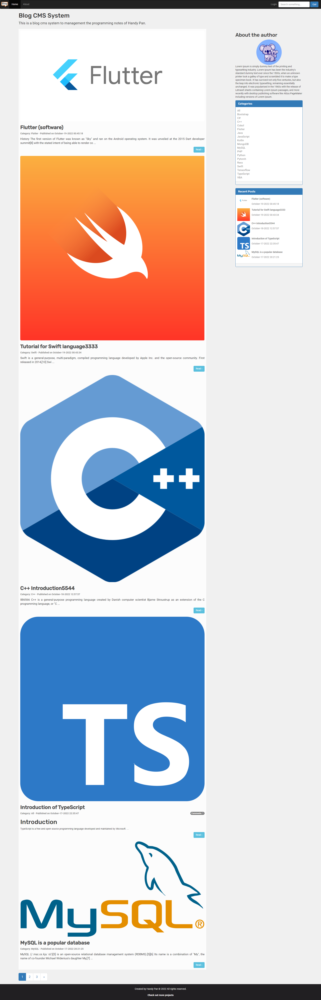
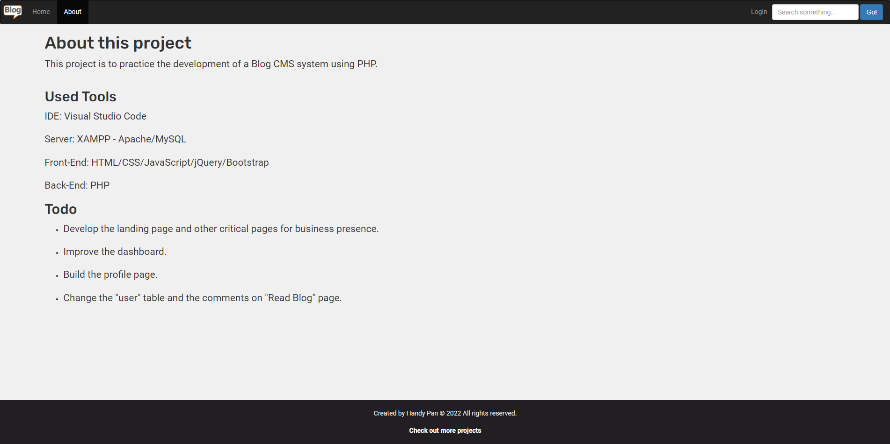
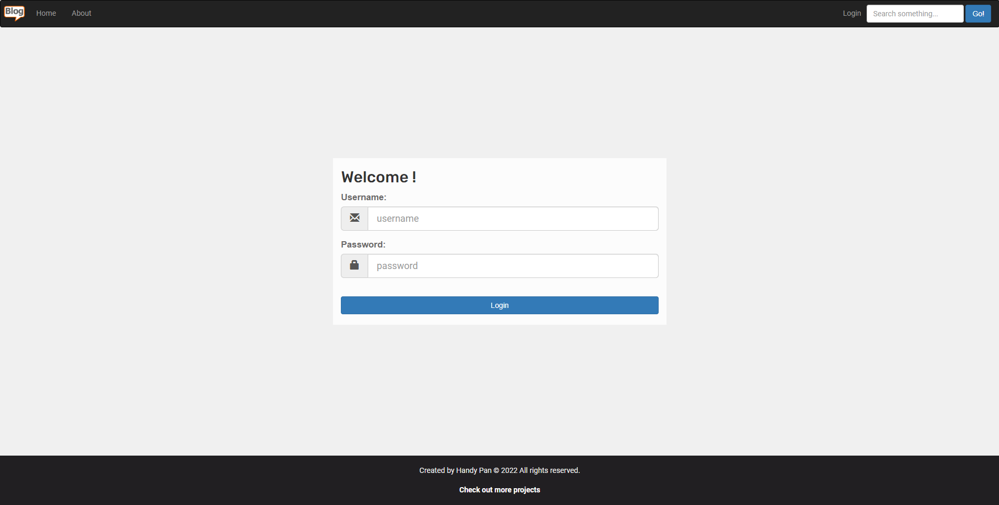
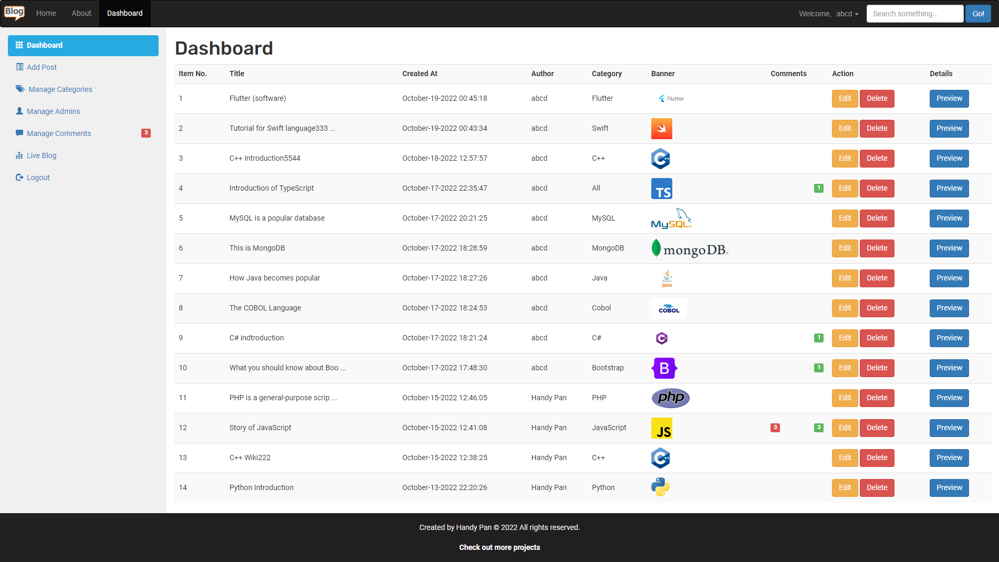
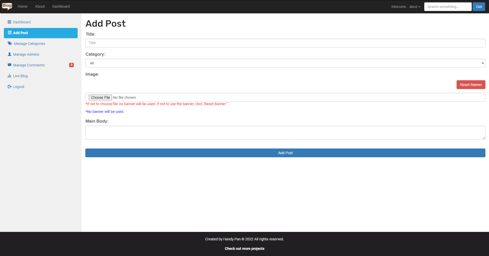
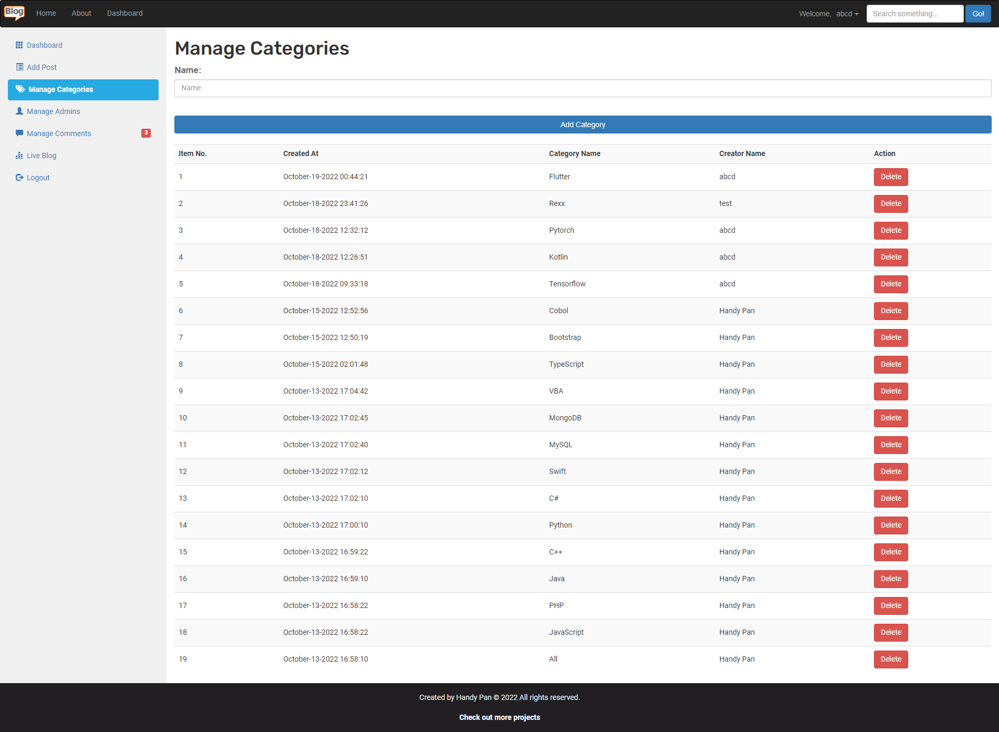
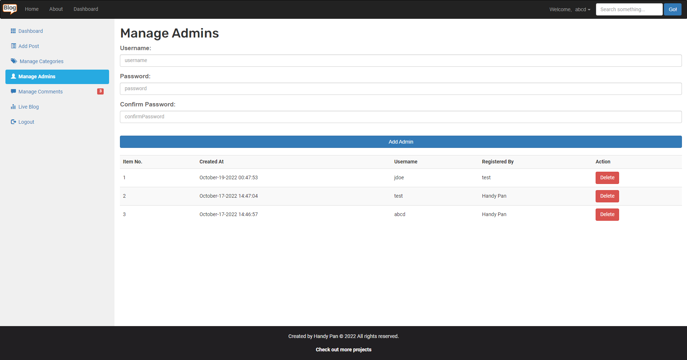
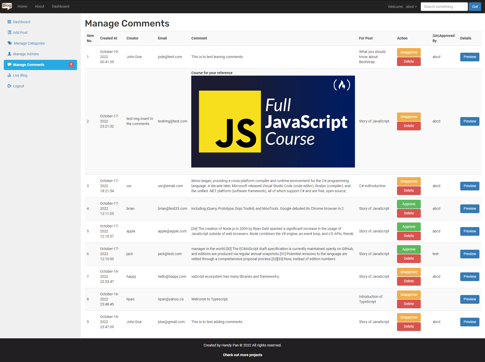
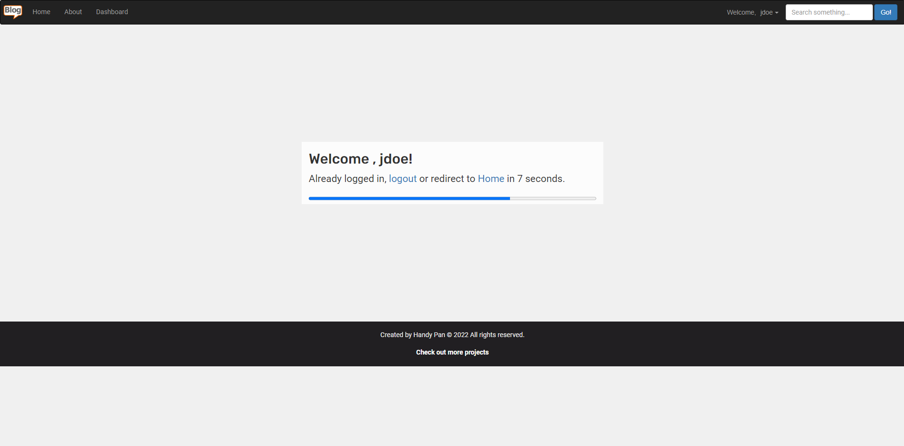

# Ex001 - Blog CMS System
This project is to practice the development of a Blog CMS system using PHP.

## 0. Used Tools
IDE: Visual Studio Code 
Server: XAMPP - Apache/MySQL 
Front-End: HTML/CSS/JavaScript/jQuery/Bootstrap 
Back-End: PHP 

## 1. Screenshots

<b>Homepage</b>

<b>About</b>

<b>Login</b>

<b>Dashboard</b>

<b>Add Post</b>

<b>Manage Categories</b>

<b>Manage Admins</b>

<b>Manage Comments</b>

<b>Already Login</b>

## 2. Demo
[demo](https://www.youtube.com/watch?v=of_zZnQ1xB8)

## 3. How to run the code
- Run Apache server and MySQL server by XAMPP.
- Create the database and tables in MySQL server.
- Modify the codes accordingly to match the local database configurations.
- Access the index.php page by the browser and verify the functionalities.

## 4. Todo
- Develop the landing page and other critical pages for business presence.
- Improve the dashboard.
- Build the profile page.
- Change the "user" table and the comments on "Read Blog" page.
